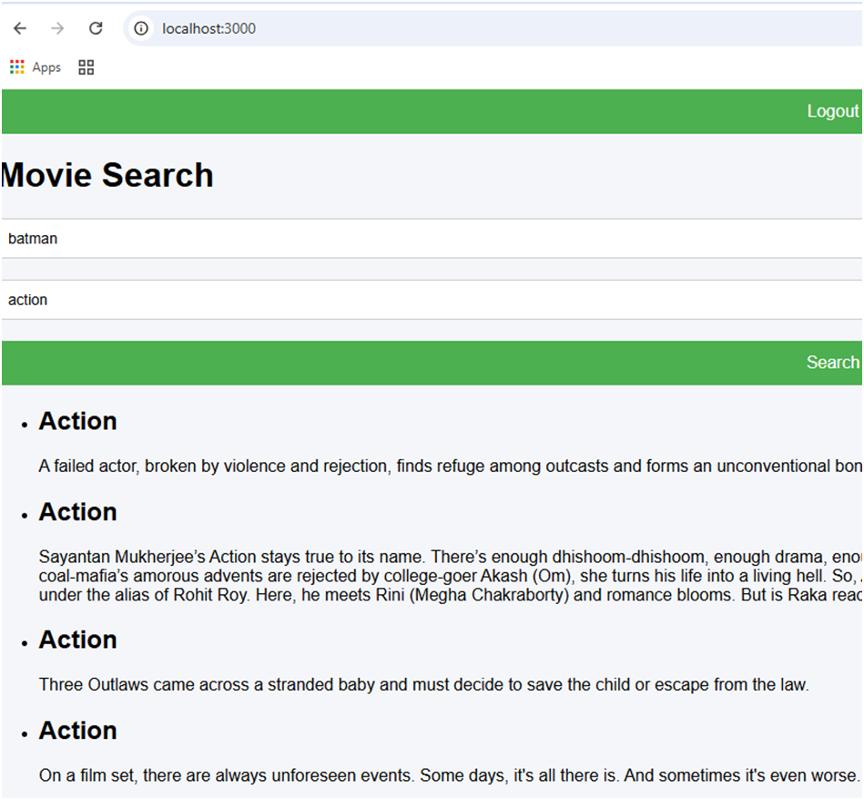

# Movie Comments API & React App

This project is a full-stack application that allows users to search for movies and post comments. It consists of a .NET Web API backend and a React frontend.


## Overview

-   **Backend**: A .NET 9 Web API (`MovieCommentsApi`) for managing movie data and user comments. It uses Entity Framework Core for data access.
-   **Frontend**: A React application (`react-movie-app`) for the user interface, allowing users to search for movies, view details, and interact with the comment system.

## Prerequisites

-   .NET 9 SDK
-   Node.js and npm

## Getting Started

### Backend (MovieCommentsApi)

1.  **Navigate to the API directory:**
    ```sh
    cd MovieCommentsApi
    ```

2.  **Restore dependencies:**
    ```sh
    dotnet restore
    ```

3.  **Run the application:**
    ```sh
    dotnet run
    ```
    The API will be running on the port specified in `Properties/launchSettings.json` (e.g., `https://localhost:7123`).

### Frontend (react-movie-app)

1.  **Navigate to the frontend directory:**
    ```sh
    cd react-movie-app
    ```

2.  **Install dependencies:**
    ```sh
    npm install
    ```

3.  **Start the development server:**
    ```sh
    npm start
    ```
    The React app will open in your browser, typically at `http://localhost:3000`.

## Project Structure

```
/
├── MovieCommentsApi/      # .NET Web API Backend
│   ├── Controllers/
│   ├── Data/
│   ├── Models/
│   ├── Services/
│   └── ...
└── react-movie-app/       # React Frontend
    ├── public/
    ├── src/
    │   ├── api/
    │   ├── components/
    │   └── ...
    └── package.json
```

